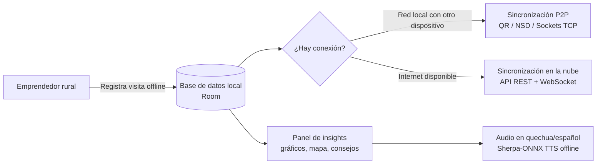

# 1. Introducción

## Objetivo del proyecto

**Yupay Turismo** es una aplicación móvil offline-first diseñada para comunidades rurales del Perú, que transforma la recolección manual de datos turísticos en información útil, accesible y accionable. Nace como una propuesta de solución al desafío público *"Del cuaderno al insight"*, planteado por el Ministerio de Comercio Exterior y Turismo (MINCETUR) y el Programa ProInnovate, cuyo propósito es empoderar a los emprendedores turísticos y mejorar la toma de decisiones públicas a partir de datos confiables.

El proyecto tiene como finalidad desarrollar una aplicación funcional que aborde los siguientes objetivos:

1. Registrar visitantes de manera sencilla y offline en entornos con conectividad limitada.
2. Transformar esos datos en insights visuales y multimodales (texto, gráficos y audio en quechua y español).
3. Permitir que el emprendedor consulte su información sin depender de Internet, sincronizándola automáticamente, tanto con otros dispositivos cercanos como con un servidor en la nube, en cuanto la conexión esté disponible.

El diseño y el desarrollo se orientan a los escenarios típicos de las comunidades priorizadas por el reto, como **Luquina (Puno)** y **Misminay (Cusco)**, de predominio quechuahablante y con conectividad intermitente, buscando que la solución sea pertinente para el contexto andino y que su arquitectura permita, en una fase posterior, incorporar otras lenguas originarias y extenderse a otras comunidades.

> **Alcance de este ciclo del proyecto:** el trabajo correspondió al desarrollo y la validación interna por parte del equipo (pruebas manuales y automatizadas, descritas en la sección 8); no incluyó un despliegue ni una validación con usuarios reales en campo.

## Breve descripción de la aplicación

**Yupay Turismo** reemplaza el tradicional cuaderno de registro por una interfaz móvil adaptada a dispositivos de gama media-baja. La aplicación permite registrar cada visita turística (procedencia del turista, servicios consumidos, descuentos aplicados y monto cobrado en la moneda preferida) sin necesidad de conexión a Internet. Los datos se almacenan localmente mediante una base de datos Room y se sincronizan de dos formas complementarias:

- **Sincronización P2P entre dispositivos cercanos**, por red local (sockets TCP, descubrimiento NSD/mDNS y emparejamiento por código QR), pensada para el escenario sin Internet de las comunidades rurales.
- **Sincronización con un servidor en la nube**, a través de una API REST propia, cuando el dispositivo cuenta con conexión a Internet, incluyendo autenticación de usuario y actualización en tiempo real mediante WebSocket.

A partir de los datos registrados, la aplicación genera:

- Un panel de control (dashboard) con gráficos de visitantes, ventas y horarios de mayor afluencia, además de un mapa pictográfico de procedencia de los turistas.
- Recomendaciones y consejos para el emprendedor según el tipo de negocio (hospedaje, alimentación o artesanía).
- Audios en quechua y español que leen los insights en voz alta mediante un motor de síntesis de voz offline (Sherpa-ONNX, con modelos MMS de Meta), facilitando la comprensión en contextos de baja alfabetización o de predominio de lenguas originarias.

La aplicación se construye íntegramente sobre el ecosistema nativo de Android (Kotlin + Jetpack Compose), priorizando el funcionamiento sin conexión, el bajo consumo de recursos y la compatibilidad con dispositivos de gama media-baja, condiciones centrales del contexto rural al que está dirigida.

