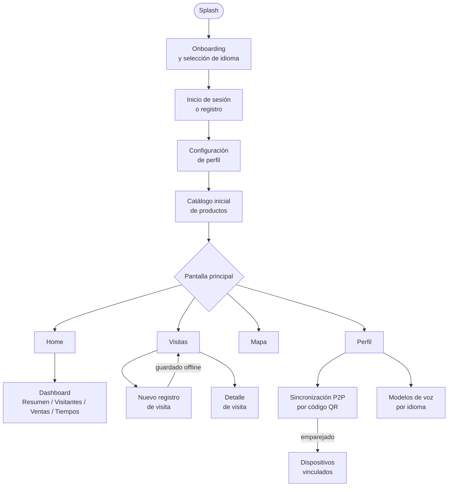

# 3. Diseño de la Aplicación

## Mockups y prototipos

El diseño de la interfaz se elaboró primero en **Figma**, cubriendo el flujo principal de la aplicación antes de su implementación en código. Las pantallas clave del prototipo fueron:

| Pantalla | Descripción |
|----------|-------------|
| Onboarding | Tres pasos con pictogramas que explicaban las funciones principales de la app ("Registra visitas sin internet", "Mira tus resultados", "Recibe consejos"). Incluyó selección de idioma. |
| Perfil del emprendedor | Permitía elegir el tipo de emprendimiento (hospedaje, alimentación, artesanía o varios) y guardaba la configuración localmente. |
| Registro de visita | Formulario adaptable al tipo de negocio, con campos obligatorios, listas desplegables para nacionalidad y rango de gasto, y un selector de servicios consumidos. |
| Panel de control | Mostraba los insights del periodo: gráfico de evolución de visitas, mapa pictográfico de procedencias y una tarjeta de recomendación, con un botón de audio para escucharla en quechua o español. |
| Sincronización | Indicador del estado de los datos pendientes de sincronizar frente a los ya enviados. |

El prototipo completo en Figma se mantuvo como referencia de diseño durante todo el desarrollo y está disponible en el siguiente enlace:

`https://www.figma.com/proto/YI8sJDKSiGodFOckt13sLw/Project_Design---DSM`

## Herramientas utilizadas

- **Figma:** diseño de interfaces, prototipado interactivo y definición de guías de estilo (colores, tipografía adaptada a legibilidad en pantallas pequeñas, iconografía).
- **Material Design 3 (Jetpack Compose):** sistema de componentes y tokens de diseño para Android, que garantiza coherencia visual, soporte de tema claro/oscuro y adaptación a distintos tamaños de pantalla (incluido un layout horizontal con riel de navegación lateral para tablets).

## Flujo de pantallas

El flujo implementado en la aplicación sigue la siguiente secuencia:

1. **Inicio (Splash)** → **Onboarding** (solo la primera vez, con selección de idioma entre español, inglés, portugués y quechua) → **Inicio de sesión o registro** (correo y contraseña, o Google) → **Configuración de perfil**.
2. **Configuración de perfil:** nombre y tipo de emprendimiento (Hospedaje, Alimentación, Artesanía o Varios) → catálogo inicial de productos → guardado local.
3. **Pantalla principal**, organizada en cuatro secciones con barra de navegación inferior (o riel lateral en horizontal):
   - **Home:** resumen de actividad reciente y acceso a consejos para el emprendedor.
   - **Visitas:** historial de registros y formulario de nuevo registro (nacionalidad, servicios consumidos, descuentos y total).
   - **Mapa:** mapa offline de procedencia de los turistas (OpenStreetMap).
   - **Perfil:** datos del negocio, idioma, moneda, modelos de voz, ayuda, política de privacidad y estado de sincronización.
4. **Dashboard de insights**, accesible desde Home, con cuatro pestañas (Resumen, Visitantes, Ventas, Tiempos) y un filtro de periodo compartido entre ellas.
5. **Sincronización entre dispositivos (P2P):** emparejamiento por código QR sobre la red local, con pantallas de estado de conexión y de dispositivos vinculados.
6. **Sincronización con la nube:** automática en segundo plano una vez que el usuario vincula su cuenta, sin pantalla dedicada (un indicador de estado es lo único visible para el usuario).

> **Nota sobre el motor de síntesis de voz.** El botón de audio presente en el panel de insights y en las pantallas de detalle reproduce la voz mediante el motor offline Sherpa-ONNX (sección 4), no mediante el TTS nativo de Android. Si el emprendedor no ha descargado previamente una voz para su idioma, el botón se muestra deshabilitado con una indicación para configurarla desde Perfil.