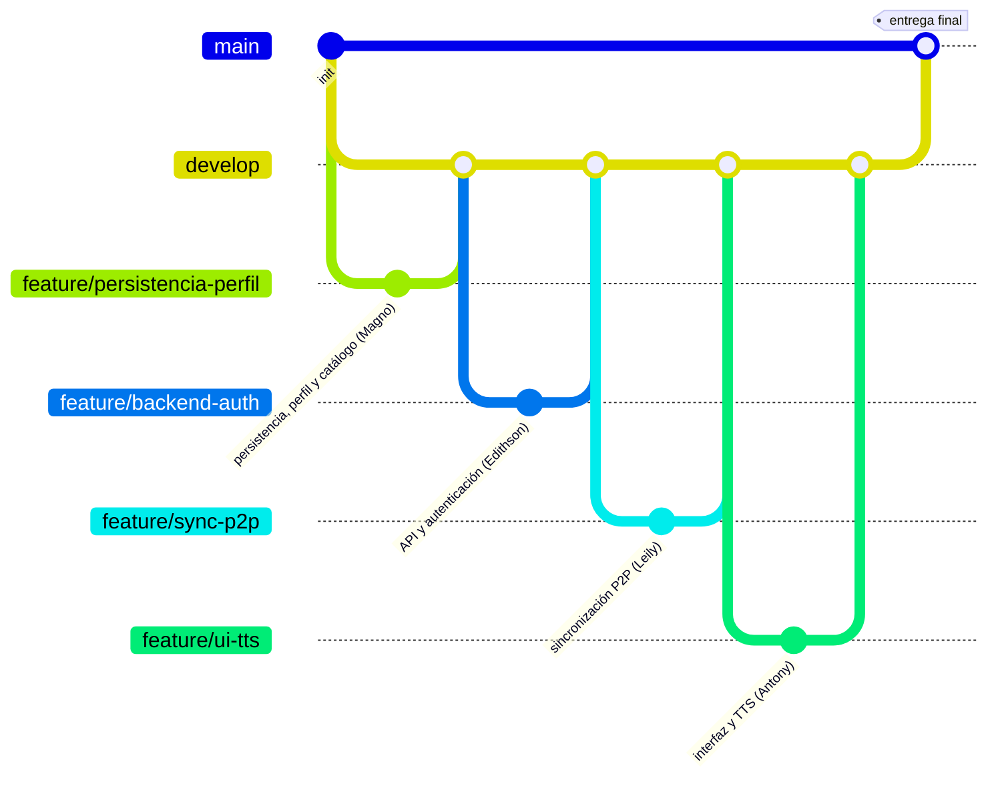

# 5. Control de Versiones con Git

## Uso de Git y GitHub

El código fuente del proyecto se gestionó completamente con **Git** y se alojó en un repositorio de **GitHub**, lo que facilitó la colaboración entre los cuatro integrantes, la trazabilidad de los cambios y la transparencia del proceso de desarrollo.

- **Repositorio:** Yupay Turismo
- **URL:** `https://github.com/MaLu-afk/rural-tourism-project`

## Flujo de trabajo (ramas, commits, pull requests)

Se adoptó un flujo de trabajo basado en ramas que permitió el desarrollo paralelo de funcionalidades y una integración controlada:

### Ramas principales
- `main`: rama de producción, con el código estable y listo para la entrega.
- `develop`: rama de integración, donde se fusionó el trabajo de los cuatro integrantes antes de pasar a `main`.

### Ramas auxiliares
- `feature/<nombre>`: cada módulo se desarrolló en una rama dedicada (por ejemplo, `feature/registro-offline`, `feature/sync-p2p`, `feature/dashboard-insights`).
- `bugfix/<descripción>`: para la corrección de errores detectados durante las pruebas.

### Ciclo de trabajo
1. Cada integrante creó una rama `feature/` desde `develop` para su módulo de responsabilidad.
2. Se realizaron commits atómicos con mensajes descriptivos siguiendo la convención de **Conventional Commits** (`feat`, `fix`, `docs`, `refactor`, `test`, `chore`).
3. Al finalizar un módulo, se abrió un **Pull Request** hacia `develop`.
4. Los cambios se integraron en `develop` una vez revisados.
5. Al cierre del proyecto, `develop` se fusionó en `main` como entrega final.

### Convenciones de commits

| Prefijo | Uso |
|---|---|
| `feat` | Nueva funcionalidad |
| `fix` | Corrección de error |
| `docs` | Cambios en documentación |
| `refactor` | Reestructuración de código sin cambiar funcionalidad |
| `test` | Adición o modificación de pruebas |
| `chore` | Tareas de mantenimiento o configuración del proyecto |

*Ejemplo:* `feat(visitas): formulario de registro de visita con servicios y descuentos`

## Distribución del trabajo por roles

El equipo organizó el desarrollo en cuatro roles funcionales, cada uno responsable de un dominio técnico completo de la aplicación, lo que permitió que cada integrante avanzara con autonomía sobre su área y que el código se mantuviera cohesionado dentro de cada módulo:

| Integrante | Rol |
|---|---|
| Magno Ricardo Luque Mamani | **Persistencia y experiencia del emprendedor** — base de datos local y módulo de perfil/catálogo de productos |
| Edithson Ricardo Aybar Escobar | **Backend e identidad** — integración con la API en la nube y autenticación de usuarios |
| Leily Marlith Llanos Angeles | **Conectividad y plataforma** — sincronización P2P, infraestructura transversal y mapa de visitas |
| Antony Ivan Mendoza Villar | **Interfaz y accesibilidad multimodal** — componentes de UI, síntesis de voz y pantallas de negocio |

El rol de persistencia se desarrolló primero, al ser la base de la que dependieron los demás módulos; los roles de backend y de conectividad avanzaron en paralelo sobre esa base; y el rol de interfaz integró los datos, la navegación y los servicios construidos por los otros tres roles en las pantallas finales de la aplicación.

