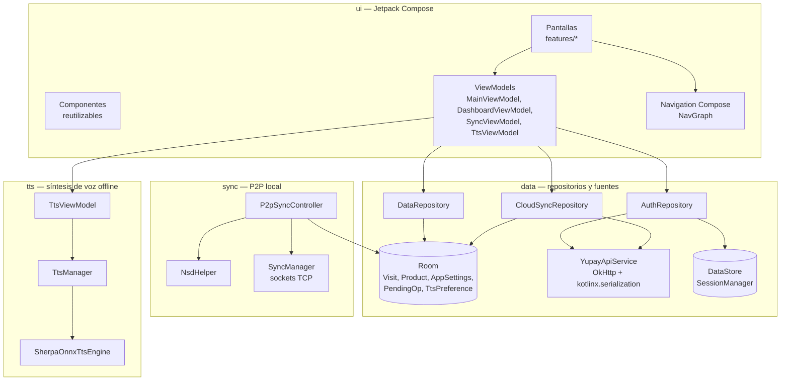

# 6. Arquitectura y Desarrollo

## Patrón arquitectónico

La aplicación se organiza bajo el patrón **MVVM (Model-View-ViewModel)**, en una arquitectura de dos capas: `data` y `ui`, sin una capa `domain` independiente. Esta fue una decisión deliberada del equipo respecto a la propuesta inicial (que consideraba Clean Architecture de tres capas): dado el tamaño del equipo y el plazo del curso, la lógica de negocio se ubica directamente en los ViewModels y en los repositorios de la capa `data`, evitando una capa de casos de uso que habría añadido una indirección adicional sin un beneficio claro para un proyecto de este alcance.

## Organización del código y componentes

El código fuente se organiza en ocho paquetes principales bajo `yupay.turismo`, cada uno con una responsabilidad clara:

- **`data`**: capa de datos. Contiene `local` (entidades y DAOs de Room), `remote` (cliente HTTP, DTOs, mapeos), `repository` (`AuthRepository`, `CloudSyncRepository`), `session` (gestión de tokens), `sync` (motor de sincronización con la nube) y `prefs`.
- **`sync`**: motor de sincronización P2P por red local, independiente del ciclo de vida de la actividad (corre como un proceso de aplicación mediante `ServiceLocator` y `SyncForegroundService`).
- **`tts`**: síntesis de voz offline, con subpaquetes `audio` (reproducción y caché), `download` (descarga de modelos con WorkManager) y `engine` (integración con Sherpa-ONNX).
- **`notifications`**: construcción y disparo de notificaciones del sistema.
- **`service`**: servicio en primer plano que mantiene activa la sincronización P2P.
- **`di`**: localizador de servicios (`ServiceLocator`) que centraliza la creación de instancias compartidas entre ViewModels y componentes de proceso.
- **`ui`**: interfaz de usuario, con `components` (piezas reutilizables), `features` (pantallas agrupadas por funcionalidad: `auth`, `dashboard`, `home`, `map`, `onboarding`, `profile`, `splash`, `sync`, `visits`, `info`), `navigation` (rutas y grafo de navegación) y `theme` (colores, tipografía).
- **`utils`**: utilidades transversales (conversión de moneda, monitor de red, permisos, traducciones de texto dinámico).

### Decisiones de diseño relevantes

- **Inyección de dependencias manual.** En lugar de Hilt, se usa un `ServiceLocator` que instancia y retiene los componentes de larga vida (base de datos, repositorios, motor de sincronización P2P). Esta decisión permite que el motor P2P sobreviva más allá del ciclo de vida de una `Activity`, requisito necesario para que la sincronización siga funcionando con la app en segundo plano.
- **Doble motor de sincronización, independientes entre sí.** La sincronización con la nube (`CloudSyncEngine`, basada en un patrón outbox y WebSocket) y la sincronización P2P (`P2pSyncController`, basada en sockets TCP) operan de forma desacoplada: un fallo o una desconexión en una no afecta a la otra. Ambas comparten la misma fuente de datos local (Room), evitando que el emprendedor tenga que elegir entre un modo u otro.
- **Migraciones de base de datos.** El esquema de Room llegó a la versión 13, con una migración manual explícita (v12→v13, que añadió un identificador estable `uuid` a las tablas `products` y `visits` para soportar el merge de datos entre dispositivos en la sincronización P2P) y `fallbackToDestructiveMigration` como red de seguridad para los demás cambios de esquema.
- **Encapsulamiento de librerías externas.** Tanto el uso de Vico (gráficos) como el de Sherpa-ONNX (voz) se aíslan en módulos propios (`VicoCharts.kt`, `SherpaOnnxTtsEngine.kt`), de modo que el resto de la aplicación no depende directamente de la API de esas librerías.